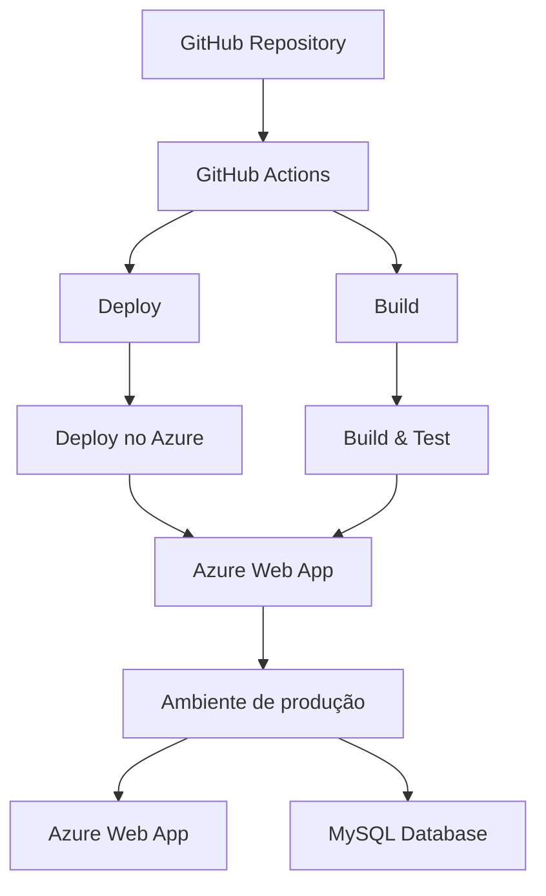

# Desafio de API de Localidades - Nível Pleno

[](https://github.com/GuilhermeAFerrari/DesafioDotNetBaltaIO/blob/main/LICENSE)


Resolução do desafio proposto pela plataforma [Balta.io](https://balta.io/), que consistiu na criação de uma API de Localidades com base nos dados abrangentes sobre cidades e estados de todo o Brasil. O desafio foi estruturado em torno de um [repositório](https://github.com/andrebaltieri/ibge) contendo dados do IBGE pertinentes a todas os municípios do país.

## Grupo - 18

[Guilherme Ferrari](https://github.com/GuilhermeAFerrari)

[Samuel Felipe Lima](https://github.com/SamuelFLM)

[Bruno Loures](https://github.com/louresb)

## Ferramentas utilizadas

- .NET 7
- Minimal API
- Clean Architecture
- Swagger 
- Xunit 
- Razor Pages
- Azure 
- MySQL

## Requisitos do Desafio

- Autenticação e Autorização
    - Cadastro de E-mail e Senha
    - Login (Token, JWT)
- CRUD de Localidade
    - Código, Estado, Cidade (Id, City, State)
- Pesquisa por cidade
- Pesquisa por estado
- Pesquisa por código do IBGE
- Boas práticas da API 
    - Versionamento
    - Padronização 
    - Documentação (Swagger)

## Documentação

Consulte a documentação no Swagger. Você pode acessá-la [aqui](https://challenge-balta-io.azurewebsites.net/swagger/index.html).


- Para realizar login insira as informações como no JSON abaixo:

```json
{
  "email": "challenge@baltaio.com",
  "password": "1q2w3e4!@#",
  "name": "user-admin"
}
```

- Copie o Response body com o Token JWT gerado.

- Clique no botão Authorize.

- Insira Bearer seguido de seu token JWT para obter autorização nos Endpoints.

## Endpoints da API

### Location

- `GET /v1/locations` - Retorna todas as localidades disponíveis.
- `GET /v1/locations/{city}` - Pesquisar as cidades por nome.
- `GET /v1/locations/{state}` - Pesquisar os estados por nome.
- `GET /v1/locations/{ibge}` - Pesquisar por código do IBGE.
- `POST /v1/location` - Criar um registro de cidade.
- `PUT /v1/location` - Atualizar um registro de cidade.
- `DELETE /v1/location/{ibge}` - Deletar um registro de cidade.

### User

- `POST /v1/login` - Fazer login na aplicação.
- `POST /v1/register` - Criar registro de usuário.

## Screenshots

<div align="center">

### Registro / Login / Token JWT
<div>
  
  
  
  <br />
  <br />
  
</div>

### Todas as cidades / Pesquisa por cidade
<div>
  
  
  
</div>

### Pesquisa por estado
<div>
  
  
</div>

### Pesquisa por código do IBGE
<div>
  
  
</div>

### Adicionar cidade
<div>
  
    
</div>

### Editar registro / Deletar cidade
<div>
  
   
  
  
</div>
</div>

## Deploy e CI/CD



## Contribuições

Contribuições são bem-vindas! Se você encontrar algum problema ou tiver sugestões de melhorias, abra uma issue ou envie uma pull request.

## Licença
[MIT License](https://github.com/GuilhermeAFerrari/DesafioDotNetBaltaIO/blob/main/LICENSE) ©
[Bruno Loures](https://github.com/louresb),
[Guilherme Ferrari](https://github.com/GuilhermeAFerrari), 
[Samuel Felipe Lima](https://github.com/SamuelFLM).
